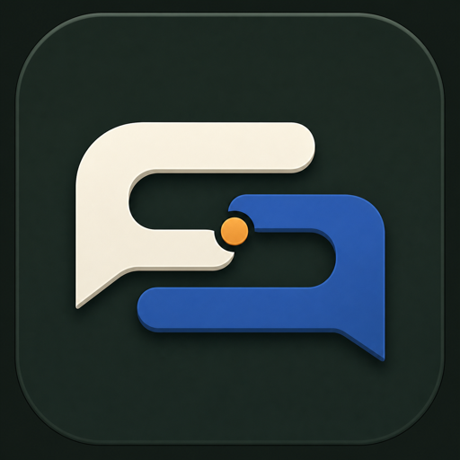
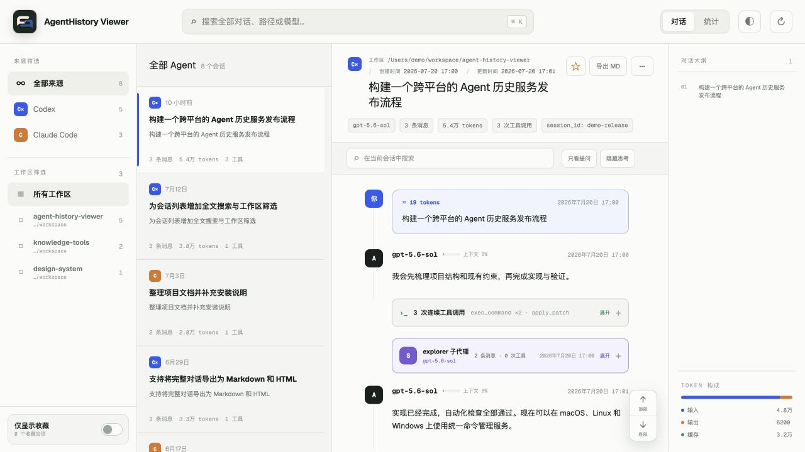
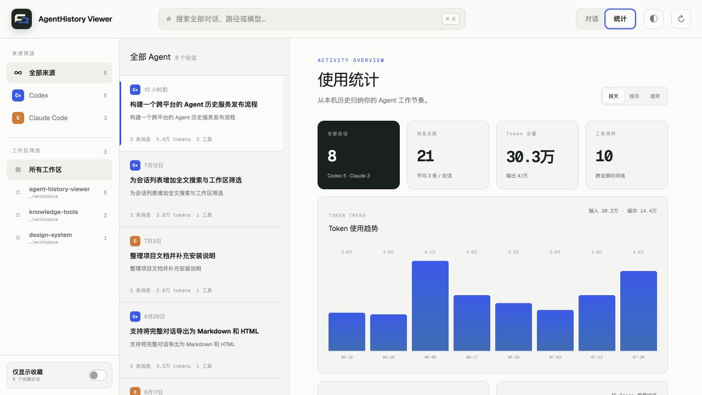
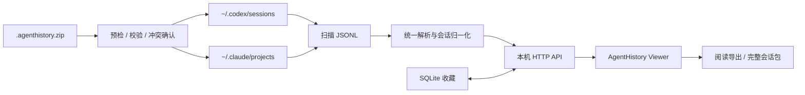

<p align="center">
  
</p>

<h1 align="center">AgentHistory Viewer</h1>

<p align="center">
  把散落在本机的 Codex 与 Claude Code 对话，变成一套可搜索、可回溯、可统计的工作档案。
</p>

<p align="center">
  
  
  
  
  <a href="LICENSE"></a>
</p>

<p align="center">
  <a href="#快速开始">快速开始</a> ·
  <a href="#功能一览">功能一览</a> ·
  <a href="#注册为系统服务">系统服务</a> ·
  <a href="#配置">配置</a> ·
  <a href="#api">API</a>
</p>



<p align="center"><sub>演示画面使用虚构会话生成，不包含真实用户历史。</sub></p>

## 它解决什么问题

Agent 的历史记录通常分散在不同目录、不同 JSONL 格式里。想找回某次排查过程、确认模型消耗、查看子代理做了什么，往往需要手动翻文件。

AgentHistory Viewer 会统一扫描并解析这些本机记录，在一个浏览器页面里提供：

- 一条按时间组织的完整对话时间线
- 跨 Codex / Claude Code 的来源、工作区和收藏筛选
- 会话搜索、全文搜索、提问大纲和快速跳转
- Token、模型、工具调用和活动趋势统计
- Markdown / HTML 阅读导出、可恢复会话包与跨平台后台服务

## 功能一览

| | 能力 | 说明 |
| --- | --- | --- |
| 🧭 | **统一导航** | 在同一侧边栏浏览 Codex、Claude Code、工作区和收藏会话。 |
| 🧵 | **结构化时间线** | 配对工具调用与结果，折叠连续工具调用，并以独立颜色展示子代理会话。 |
| 🔎 | **双层搜索** | 支持跨会话全文搜索，也可以只在当前会话内定位内容。 |
| 📌 | **收藏与大纲** | SQLite 持久化收藏；按用户提问生成大纲并快速跳转。 |
| 📊 | **使用统计** | 查看 Token 趋势、16 周活动热力图、常用模型和输入/输出/缓存构成。 |
| 📦 | **迁移与恢复** | 将完整会话导出为 `.agenthistory.zip`，在另一台机器或另一位用户的环境中导入并继续对话。 |
| ⚙️ | **跨平台服务** | 可注册为 macOS、Linux、Windows 系统服务。 |

### 会话时间线

- 显示工作区、Session ID、创建时间、更新时间和模型
- 为每条用户消息估算输入 Token
- 展示 Agent 模型名与上下文窗口占用
- 连续工具调用默认折叠，工具输入与结果可按需展开
- 子代理会话嵌入主会话，并使用独立消息块识别
- 支持只看提问、隐藏思考、会话内搜索和顶部/底部快速跳转

### 统计仪表盘



统计可以按日、月、年查看，并汇总会话数、消息数、Token 总量、工具调用次数、模型用量与活动分布。

### 完整会话迁移

1. 在源环境选择一个会话，点击标题区域的“导出会话”，下载 `.agenthistory.zip` 压缩包。
2. 在目标环境点击页面顶部的“导入”，选择刚才导出的压缩包。
3. 选择“保持原工作区”，或将会话映射到目标机器上的新工作区绝对路径。
4. 确认会话信息并执行导入；若存在相同 Session ID，按页面提示确认是否覆盖。
5. 导入完成后打开该会话，复制页面提供的命令即可恢复并继续对话。

## 工作方式



日常浏览只读取原始历史目录；只有用户明确完成会话导入时，服务才会写入对应的 Agent 历史目录。收藏数据保存在项目的 `state/history.db` 中。

## 快速开始

前提：Node.js `>= 22.13.0`（收藏功能使用 Node.js 内置 SQLite）。

```bash
git clone https://github.com/Yi-Eaaa/AgentHistory-Viewer.git
cd AgentHistory-Viewer
npm install
npm run build
npm start
```

启动后打开完整地址：[http://127.0.0.1:30100](http://127.0.0.1:30100)。

默认只监听 `127.0.0.1`。如需修改端口，macOS / Linux 可执行：

```bash
PORT=8080 npm start
```

Windows PowerShell 可执行：

```powershell
$env:PORT=8080; npm start
```

然后打开完整地址：[http://127.0.0.1:8080](http://127.0.0.1:8080)。

也可以复制配置模板：

```bash
cp .env.example .env
```

`npm start` 会自动读取项目根目录的 `.env`，Shell 环境变量优先。

## 注册为系统服务

完成依赖安装和生产构建后，运行统一的服务安装命令：

```bash
npm install
npm run build
npm run service:install
```

安装后服务会立即启动，并在后续开机或用户登录时运行。访问地址仍为 [http://127.0.0.1:30100](http://127.0.0.1:30100)。安装前请先停止手动运行的 `npm start`，避免端口冲突。

### 服务管理

```bash
npm run service:status
npm run service:restart
npm run service:uninstall
```

| 平台 | 服务实现 | 日志 / 说明 |
| --- | --- | --- |
| macOS | 当前用户的 `launchd` LaunchAgent | 配置位于 `~/Library/LaunchAgents/com.agent-history.viewer.plist`；日志位于 `state/service.stdout.log` 与 `state/service.stderr.log`。 |
| Linux | `systemd --user` 服务 `agent-history.service` | 使用 `journalctl --user -u agent-history` 查看日志；如需登录前启动，可由管理员启用 linger。 |
| Windows | Windows SCM 服务 `AgentHistory` | 通过固定版本的 [WinSW](https://github.com/winsw/winsw) 注册；首次安装需要联网，并需在管理员终端执行。 |

更新项目后执行：

```bash
npm install
npm run build
npm run service:restart
```

如果移动了项目目录或更换了 Node.js 安装位置，请重新运行 `npm run service:install`，让服务记录新的绝对路径。
在 macOS 上，如果 LaunchAgent 配置仍在但注册状态意外丢失，`npm run service:restart` 会自动重新注册并启动服务。

## 配置

| 环境变量 | 默认值 | 用途 |
| --- | --- | --- |
| `HOST` | `127.0.0.1` | HTTP 服务监听地址 |
| `PORT` | `30100` | 浏览器访问端口 |
| `CODEX_HISTORY_ROOT` | `~/.codex/sessions` | Codex 历史目录 |
| `CLAUDE_HISTORY_ROOT` | `~/.claude/projects` | Claude Code 历史目录 |
| `AGENT_HISTORY_STATE` | `./state` | 收藏数据库与运行状态目录 |
| `AGENT_HISTORY_USERNAME` | 空 | HTTP Basic Auth 用户名 |
| `AGENT_HISTORY_PASSWORD` | 空 | HTTP Basic Auth 密码 |
| `AGENT_HISTORY_IMPORT_MAX_BYTES` | `536870912` | 单个导入压缩包的最大字节数，默认 512 MiB |

若要从同一局域网的其他设备访问，请同时配置监听地址和认证：

```bash
HOST=0.0.0.0 PORT=30100 \
AGENT_HISTORY_USERNAME=viewer \
AGENT_HISTORY_PASSWORD='请替换为强密码' \
npm start
```

然后访问 `http://<本机局域网IP>:30100`。

## API

<details>
<summary><strong>展开 HTTP API 列表</strong></summary>

| 方法 | 路径 | 说明 |
| --- | --- | --- |
| `GET` | `/api/health` | 服务健康检查 |
| `GET` | `/api/sessions` | 会话列表；支持 `source`、`workspace`、`q`、`favorite`、`limit`、`offset` |
| `GET` | `/api/sessions/:source/:id` | 获取完整会话时间线 |
| `POST` | `/api/refresh` | 重新扫描历史目录 |
| `PUT` / `DELETE` | `/api/favorites/:source/:id` | 添加或移除收藏 |
| `GET` | `/api/stats` | 使用统计；支持 `source`、`granularity`、`from`、`to` |
| `GET` | `/api/export/:source/:id?format=md\|html` | 导出 Markdown 或 HTML |
| `GET` | `/api/portable/export/:source/:id` | 导出可恢复的 `.agenthistory.zip` 完整会话包 |
| `POST` | `/api/portable/inspect` | 预检并校验会话包，返回短期导入令牌，不写入历史目录 |
| `POST` | `/api/portable/import?mode=original\|mapped&workspace=...&overwrite=true\|false` | 使用预检令牌导入会话；映射模式需要目标工作区，冲突覆盖需要显式确认 |

`/api/sessions` 仍兼容旧参数 `project`，建议新调用使用 `workspace`。

</details>

## 项目结构

```text
- app/                    React 页面与样式
- server/
  - index.mjs             HTTP API、Basic Auth、页面反向代理
  - history-store.mjs     文件扫描、缓存、搜索、收藏、统计、导出
  - parsers.mjs           Codex / Claude Code 格式归一化
  - portable-session.mjs  完整会话包、校验、路径映射、备份与恢复
- scripts/
  - run.mjs               同时管理页面与 API 进程
  - service.mjs           macOS / Linux / Windows 服务管理入口
- deploy/windows/         Windows SCM / WinSW 安装脚本
- docs/assets/            README 演示截图
- state/                  收藏数据库与运行日志（Git 忽略）
- tests/                  解析器、存储、页面与服务测试
```

## 联系方式

- Email：[iyhong@foxmail.com](mailto:iyhong@foxmail.com)
- 微信：`Yi_Eaaa`

## License

本项目基于 [MIT License](LICENSE) 开源。

Copyright © 2026 Yi Hong

---

<p align="center">
  <strong>AgentHistory Viewer</strong><br>
  让每一次 Agent 协作都可检索、可理解、可复用。
</p>
